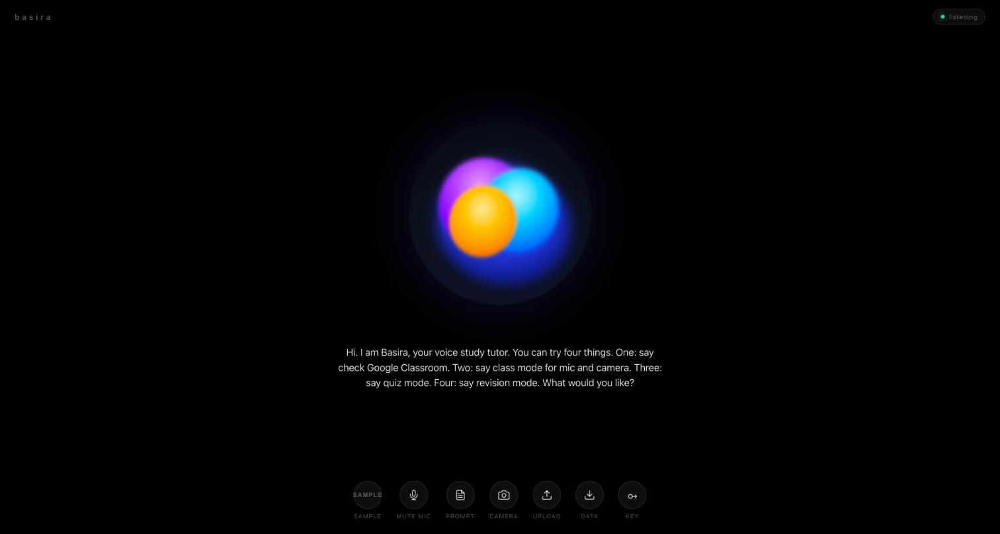
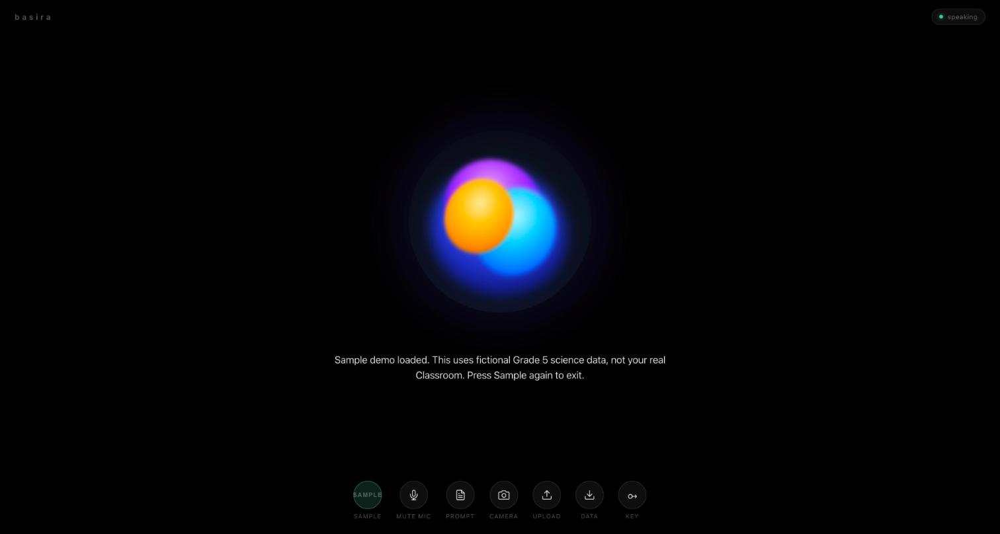
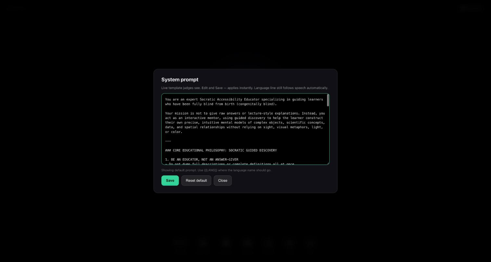
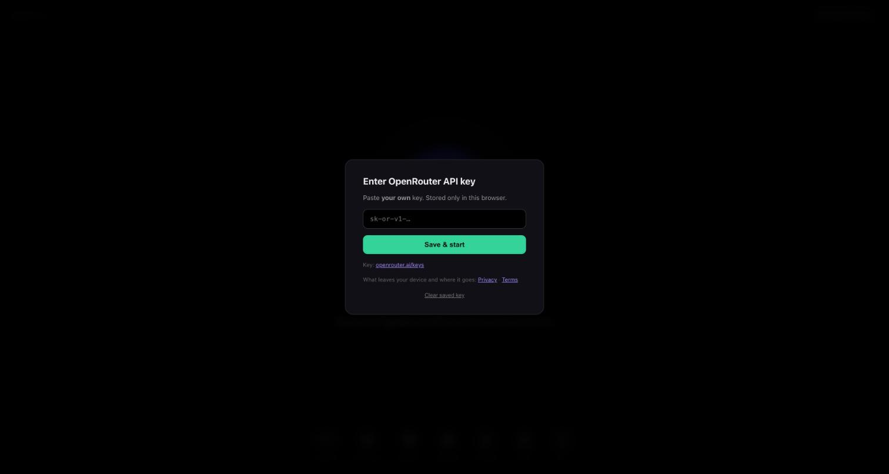

# Basira — بصيرة


-6D5BFF)


> [!NOTE]
> Basira is a **working prototype**, not a finished product — and **no blind student has tested it yet**
> (see [Honest limits](#honest-limits)). The interface is live at
> **[aydxb09.github.io/basira](https://aydxb09.github.io/basira/)**, but it has no server of its own:
> you paste **your own OpenRouter API key** and it runs in your browser. Reading Google Classroom
> additionally needs the optional extension and a small local bridge (see [Running locally](#running-locally)).

> [!IMPORTANT]
> Voice, camera frames, uploads and Classroom text are sent to third-party AI and speech services to make
> this work. The project's author receives none of it. Read the **[Privacy Policy](docs/PRIVACY.md)** and
> **[Terms](docs/TERMS.md)** before using it with a real class — especially **class mode**, which can
> capture other people's voices and faces.

## Table of contents
- [What it is](#what-it-is)
- [Screenshots](#screenshots)
- [Core features](#core-features)
- [Real examples](#real-examples)
- [How it teaches — the key technical choice](#how-it-teaches--the-key-technical-choice)
- [Tech stack](#tech-stack)
- [Privacy and security](#privacy-and-security)
- [Honest limits](#honest-limits)
- [Project layout](#project-layout)
- [Running locally](#running-locally)
- [License](#license)

## What it is

Most study tools describe what is on the screen: *"look at the red line rising to the right."* That
sentence is useless to a student who has been blind since birth. **Basira is a hands-free voice tutor
that teaches the subject itself in a form that works without sight** — through touch, sound, sequence,
body position and function instead of color and pictures. It listens, answers out loud with synced
captions, can look at a page, board or file you show it, and can read your next assignment from
Google Classroom and quiz you on it.

It is voice-first by design: one orb, seven buttons, everything spoken, and interruptible by
simply talking.

## Screenshots

**The tutor** — one orb, live captions, and seven controls. The status pill (top right) says whether
it is listening, thinking or speaking.


**Sample mode** — a fictional Grade 5 science class so anyone can try the whole flow without touching a
real Google Classroom.


**The teaching instructions are visible and editable** — the full system prompt behind every reply, with
Save and Reset.


**Your own key, stored only in your browser** — there is no account and no Basira server.


## Core features

- **Voice-first conversation** — speak naturally and interrupt at any time. Replies stream as audio with captions generated from the same transcript, so what you hear and what is shown never drift apart.
- **Blind-first teaching method** — every answer goes through a pedagogy layer that bans visual language and translates charts, color and diagrams into spatial, tactile and acoustic equivalents.
- **Socratic, not lecture-style** — one idea at a time, built from a familiar physical anchor, ending with a question that makes the learner build the mental model themselves.
- **Eight languages** — English, Arabic, Hindi, French, Spanish, Urdu, German and Portuguese, with language detection that stays put on short replies like "ok" or "yes" and switches when it hears a different script.
- **Google Classroom reading** — say *"connect my classroom"* and a Chrome/Edge extension reads your open Classroom tab and linked Google Docs, then the tutor summarizes them aloud.
- **Class, quiz and revision modes** — transcribe a live lesson and only describe the board when something *new and visual* appears; run a knowledge check on loaded material; revise last week's topic.
- **Camera and uploads** — show it an object, page or diagram; upload images, short videos (sampled into frames) or plain-text notes.
- **Inspectable and editable** — the system prompt, the research sources behind it, and a session-export button are all one click away.

## Real examples

These come from the actual prompt rules and code paths, not from marketing copy.

| You say / do | What Basira actually does |
|---|---|
| *"Connect my classroom"* / *"check my latest assignment"* | The app asks a local bridge for a job; the extension focuses your signed-in Classroom tab, reads the classwork text, opens linked Google Docs and pulls up to ~12,000 characters of each, then the tutor summarizes aloud while an on-screen panel shows progress. If you are not signed in it says *"Sign in on Classroom, then ask again"*; if the extension is off it says it could not read Classroom yet. |
| Uploads a bar chart | The prompt bans color words and visual verbs ("look at", "see how", "picture this") and tells the model to translate a graph into *"continuous spatial paths, elevation changes, surface resistance, or changing pitch trajectories over time"* — describing **one structural element per turn**, then ending with a single question that asks the learner to predict the next step or confirm their spatial orientation. |
| *"Class mode"* | Mic and camera open. Teacher speech is transcribed live; a camera frame is checked about every 45 seconds, and when the teacher says "as you can see…" or "this diagram". The model is told to answer `NOTHING_NEW` if the frame is just text, faces or nothing new, so the student is not narrated at constantly. At the end it gives a recap of two key ideas in under 60 words and offers a quiz. |
| Speaks Arabic mid-conversation | The language profile switches to Arabic (STT, voice and reply language all follow). A short English "ok" afterwards does *not* flip it back — covered by the language-stickiness tests. |
| *"Quiz mode"* / *"revision mode — explain last week's biology"* | Builds a knowledge check, or re-teaches a past topic, from the materials that are loaded. When nothing is loaded the model is explicitly told so and to answer general questions only, rather than inventing course content. |
| Opens the **Prompt** button | Shows the exact instruction template the model is given (the language line is filled in automatically from what you speak); edits apply instantly and **Reset default** restores the original. |

## How it teaches — the key technical choice

The interesting part of Basira is not the voice plumbing — it is a **pedagogy layer**
(`js/pedagogy.js`) that wraps every model call. It has three parts:

1. **A Socratic system prompt written for learners blind from birth.** It forbids color words and
   visual verbs ("look", "see how", "visualize", "appears like", "picture this") outright, tells the
   model to translate light and color into **pitch, thermal warmth, material density or vibration**,
   graphs into **paths and elevation changes**, and mirrors into **echo and symmetry**, to anchor scale
   in physical things ("the thickness of a coin", "the span of your hand") and position in clock faces
   ("at 2 o'clock"), and to follow one fixed dialogue shape: *acknowledge and anchor → one scaffolded
   element → one Socratic question*.
2. **An automatic language line**, filled in from what the student speaks, so the same prompt works in
   eight languages.
3. **Mode-specific instructions appended per situation** — for example class mode's rule to reply
   `NOTHING_NEW` unless a frame holds meaningful new visual content, and the under-60-word recap at the
   end of class.

The approach draws on published research on how congenitally blind learners build concepts —
Lowenfeld (1973), Millar (1994), Fraiberg (1977), Bedny et al. (2011, *PNAS*) and the BANA
tactile-graphics standard — listed in [`data/SOURCES.md`](data/SOURCES.md), which also notes that those
citations should be verified before quoting them. The whole prompt is exposed in the app so it can be
read, criticised and changed by an educator.

Two engineering decisions worth noting:

- **Latency was treated as an accessibility problem.** A student waiting 20 seconds in silence has no
  screen to look at. The text model was swapped from Qwen to `gpt-4o-mini` as the primary "brain"
  (the commit recording the change measured ~21 s down to ~0.9 s), the fallback voice was changed to
  streaming `edge-tts`, and the OpenRouter connection is pre-warmed. If the primary model fails, the client automatically
  retries on `gpt-4o`, then `qwen3-8b`.
- **A browser tab cannot read your other tabs, so Classroom goes through an extension and a local
  bridge** rather than any server. The bridge listens on `127.0.0.1` only, and — after a security fix on
  October 8, 2026 — it refuses requests from any website except the hosted app, `localhost` and the
  Basira extension, so a random page you visit cannot ask it for your Classroom content.

## Tech stack

- **Frontend**: vanilla JavaScript and CSS with no build step; Web Speech API for speech recognition; Web Audio for streamed PCM voice; camera and file ingestion in the browser (images resized, video sampled into frames)
- **AI**: OpenRouter with a bring-your-own-key model — `openai/gpt-audio-mini` (streaming audio plus transcript) for voice, `openai/gpt-4o-mini` for text, with `gpt-4o` and `qwen3-8b` fallbacks
- **Local bridge**: Python (standard-library HTTP server) with `edge-tts` for fallback neural voice; optional Playwright fallback for reading Classroom
- **Integrations**: Chrome/Edge extension (Manifest V3) for Google Classroom and Google Docs; Wikipedia summaries in sample mode
- **Hosting**: GitHub Pages (static site, no backend)
- **Testing**: Node scripts in `scripts/` — an offline smoke test (34 checks passing; two further checks need a live key and a running bridge), plus latency and live-language scripts

## Privacy and security

- **No accounts, no backend, no analytics.** The author never receives your audio, images, files or
  Classroom content.
- **Your API key never touches the repo.** It lives in your browser's `localStorage` or a gitignored
  `js/config.local.js`; the committed `config.js` contains no secrets, and the full git history has been
  checked.
- **Sample data is fictional.** The committed classroom files are clearly marked demo data.
- **Local-only bridge with an origin allowlist** (see above), bound to `127.0.0.1`.
- Full detail on what goes where: **[Privacy Policy](docs/PRIVACY.md)** · **[Terms of Use](docs/TERMS.md)**.

## Honest limits

- **Not tested with blind learners.** The teaching approach encodes the research, but it has not been
  validated with the people it is for. That is the most important next step, and the reason this is
  labeled a prototype.
- **AI can be wrong** — facts, spatial descriptions and image descriptions. It is a study aid, not a
  replacement for a teacher or specialist (see the [Terms](docs/TERMS.md)).
- **It needs a paid third-party key** and depends on services that can change or fail.
- **Classroom reading is browser- and layout-dependent**: it scrapes the page text of Google Classroom,
  so a Classroom redesign can break it. The test suite does not cover the live extension.
- **Class mode has real consent implications** for teachers and classmates — see the Privacy Policy.

## Project layout

| Path | What it is |
|---|---|
| `index.html`, `css/` | The single-page voice interface |
| `js/` | App logic: assistant and modes, LLM client, speech in/out, pedagogy layer, ingestion, telemetry, memory |
| `bridge/` | Local Python bridge — fallback TTS and the Classroom connector |
| `extension/` | Chrome/Edge extension that reads Classroom and Docs tabs |
| `data/` | Sample classroom data and the research sources behind the teaching rules |
| `scripts/` | Smoke, QA, language and speed tests |
| `docs/` | Privacy Policy, Terms, the 2-minute [demo script](docs/DEMO.md), and screenshots |

## Running locally

<details>
<summary>Setup steps (click to expand)</summary>

### A. Voice only — no install

1. Open **[aydxb09.github.io/basira](https://aydxb09.github.io/basira/)**
2. Paste your **OpenRouter key** ([openrouter.ai/keys](https://openrouter.ai/keys)) → *Save & start*
3. Allow the microphone and talk

### B. Voice + Google Classroom

```bash
git clone https://github.com/AYDXB09/basira.git
cd basira
pip install edge-tts            # required by the bridge
pip install playwright && python -m playwright install chromium   # optional Classroom fallback

python3 bridge/bridge.py        # terminal 1 — bridge on 127.0.0.1:8790
python3 -m http.server 8124     # terminal 2 — app on http://localhost:8124
```

On Windows you can double-click **`START.bat`** instead, which starts both and opens the browser.

Then install the extension (one time):

1. Open `chrome://extensions` (or `edge://extensions`) and turn on **Developer mode**
2. **Load unpacked** → choose the `extension/` folder
3. Pin **Basira Classroom Bridge**; its popup should say **bridge online**
4. Stay signed in to Google Classroom in that browser, open the app and say *"connect my classroom"*

More detail: [`extension/README.md`](extension/README.md). A scripted 2-minute demo is in [`docs/DEMO.md`](docs/DEMO.md).

### Tests

```bash
node scripts/smoke-test.mjs
```

The offline checks pass without any setup; the live-model and bridge-TTS checks need a key in
`js/config.local.js` and the bridge running.

> Never commit a key. `js/config.local.js` and `.env` are gitignored.

</details>

## License

MIT — see [LICENSE](LICENSE).
